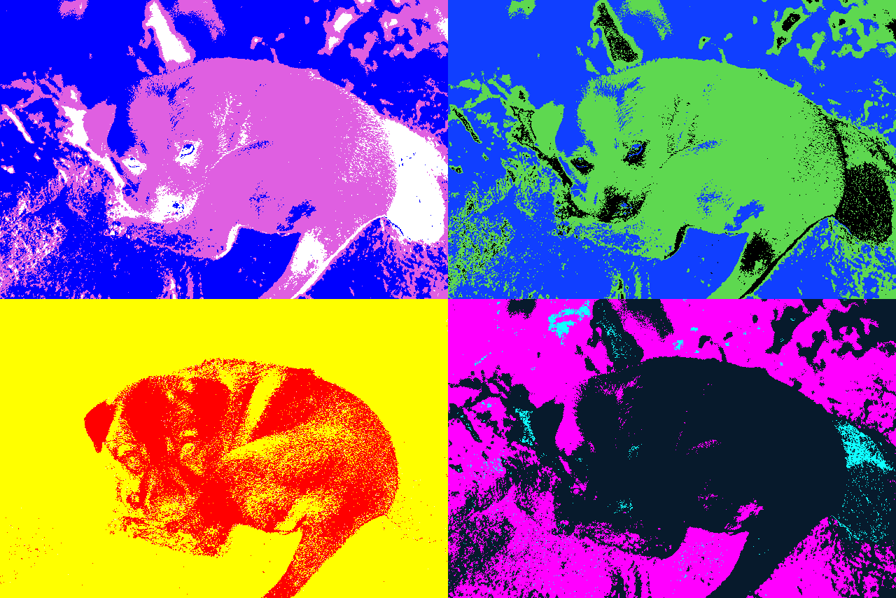

# imagelib [](http://godoc.org/github.com/xyproto/imagelib)

Package for dealing with RGB, HSV and HSL colors, reading and writing images.

* [Online API documentation](http://godoc.org/github.com/xyproto/imagelib)

## Example

[](https://www.flickr.com/photos/49021451@N00/5679373686)

The above image is by Andrea Schaffer and is licensed under the [Creative Commons Attribution 2.0 Generic license](https://creativecommons.org/licenses/by/2.0/).

### Transformed output



The above image was generated with the following program:

```go
package main

import (
    "image"
    "image/color"
    "image/draw"
    "log"

    "github.com/xyproto/imagelib"
)

// convert takes an image file and modifies it based on a specified threshold and two given colors.
// It returns a processed image.
func convert(infilename string, thresh uint8, color1, color2 color.RGBA) image.Image {
    // Combine the two colors to create a mixed color
    mixcolor := imagelib.PaintMix(color1, color2)

    // Load the input image
    img, err := imagelib.Read(infilename)
    if err != nil {
        log.Fatalln(err)
    }

    // Separate the image into three based on the specified threshold and intensity: color1, mixcolor, and color2.
    color1image, mixcolorimage, color2image := imagelib.Separate3(img, color1, mixcolor, color2, thresh)

    // Combine the color1 image and mixcolor image to create a new image plate with color1
    color1plate := imagelib.AddToAs(color1image, mixcolorimage, color1)

    // Combine the color1plate and color2image to create an allplate image with color2 color
    // And then combine the resulting image with the mixcolorimage to get the final output image.
    allplate := imagelib.AddToAs(color1plate, color2image, color2)
    allplate = imagelib.AddToAs(allplate, mixcolorimage, mixcolor)

    return allplate
}

func main() {
    // Define input colors and process the image using convert function.
    // Repeat this process for different color combinations.
    image1 := convert("puppy.png", 255, color.RGBA{0, 0, 255, 255}, color.RGBA{255, 255, 255, 255})
    image2 := convert("puppy.png", 255, color.RGBA{16, 63, 255, 255}, color.RGBA{0, 0, 0, 255})
    image3 := convert("puppy.png", 255, color.RGBA{255, 0, 0, 255}, color.RGBA{255, 255, 0, 255})
    image4 := convert("puppy.png", 255, color.RGBA{16, 255, 255, 255}, color.RGBA{255, 0, 255, 255})

    // Create a new image to contain the 4 processed images.
    width := image1.Bounds().Dx() * 2
    height := image2.Bounds().Dy() * 2
    newimage := image.NewRGBA(image.Rect(0, 0, width, height))

    // Arrange the 4 processed images on the new image.
    draw.Draw(newimage, image1.Bounds(), image1, newimage.Bounds().Min, draw.Src)
    draw.Draw(newimage, image.Rect(image1.Bounds().Dx(), 0, width, image1.Bounds().Dy()), image2, newimage.Bounds().Min, draw.Src)
    draw.Draw(newimage, image.Rect(0, image1.Bounds().Dy(), image1.Bounds().Dx(), height), image3, newimage.Bounds().Min, draw.Src)
    draw.Draw(newimage, image.Rect(image1.Bounds().Dx(), image1.Bounds().Dy(), width, height), image4, newimage.Bounds().Min, draw.Src)

    // Write the final image to file.
    if err := imagelib.Write("generated.png", newimage); err != nil {
        log.Fatalln(err)
    }
}
```

## General information

* License: BSD-3
* Author: Alexander F. Rødseth &lt;xyproto@archlinux.org&gt;
* Version: 1.0.2
